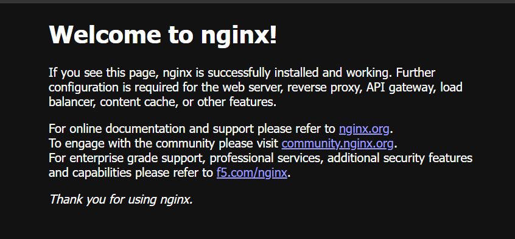
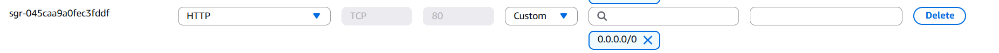
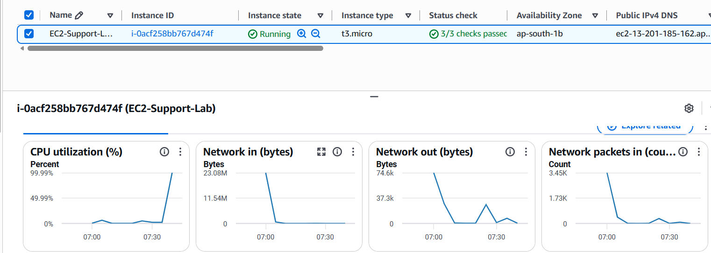
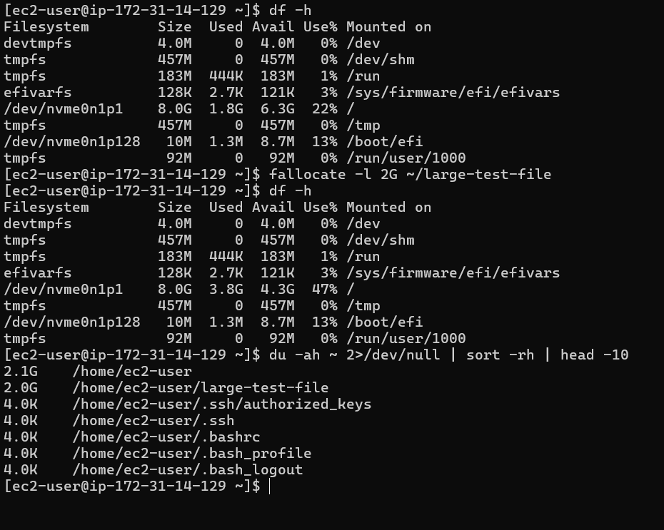
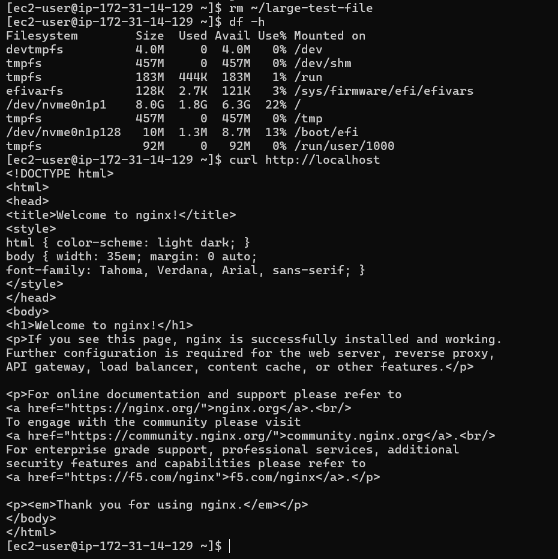

# AWS EC2 Web Server Deployment & Troubleshooting

## Project Overview

This project demonstrates hands-on AWS Cloud Support and Linux troubleshooting by deploying an Nginx web server on Amazon EC2 and simulating common infrastructure incidents.

The project focuses on identifying issues systematically, finding the root cause, restoring service, and verifying recovery.

## Technologies Used

- Amazon EC2
- Amazon Linux 2023
- Nginx
- AWS Security Groups
- Amazon CloudWatch
- Linux
- SSH

## Environment

An Amazon Linux 2023 EC2 instance was configured as an Nginx web server with SSH access for administration and HTTP access for the web application.

The environment was used to simulate and troubleshoot common cloud support incidents involving network access, Linux services, CPU utilization, and disk utilization.

## Troubleshooting Scenarios

### Detailed Incident Documentation

- [Incident 1: Security Group Connectivity Issue](documentation/incident-1-security-group.md)
- [Incident 2: Nginx Service Failure](documentation/incident-2-nginx-service.md)
- [Incident 3: High CPU Utilization](documentation/incident-3-high-cpu.md)
- [Incident 4: Increased Disk Utilization](documentation/incident-4-disk-utilization.md)

### Incident 1: Website Inaccessible Due to Security Group

The HTTP inbound rule was removed from the EC2 Security Group to simulate an externally inaccessible website.

Troubleshooting included checking the Nginx service, verifying port 80, testing the application locally with `curl`, and reviewing AWS network access.

**Root Cause:** Missing HTTP TCP port 80 inbound rule.

**Resolution:** Restored the HTTP inbound rule and verified that the website was accessible again.

### Incident 2: Nginx Service Failure

The Nginx service was stopped to simulate a web service failure.

Troubleshooting was performed using `systemctl`, `journalctl`, `ss`, and `curl`.

**Root Cause:** Nginx service was stopped.

**Resolution:** Restarted Nginx and verified both local and external website connectivity.

### Incident 3: High CPU Utilization

High CPU utilization was simulated on the EC2 instance and investigated using Linux monitoring commands and Amazon CloudWatch.

Commands such as `top` and `ps` were used to identify the CPU-consuming process.

**Resolution:** Terminated the test process and verified that CPU utilization returned to normal.

### Incident 4: Increased Disk Utilization

A temporary large file was created to simulate increased disk utilization.

`df` was used to check filesystem utilization and `du` was used to identify the large file consuming disk space.

**Resolution:** Removed the temporary file, confirmed disk utilization returned to normal, and verified the Nginx service remained accessible.

## Monitoring

Amazon CloudWatch was used to monitor EC2 CPU utilization. A CPU utilization alarm was configured as part of the monitoring practice.

## Project Evidence

### Nginx Web Server

### Security Group Configuration

HTTP port 80 was configured to allow external web traffic.

### High CPU Monitoring

A controlled CPU load test was performed and monitored using Amazon CloudWatch.

### Disk Utilization Troubleshooting

Disk utilization was increased using a temporary test file, investigated using Linux commands, and restored after identifying and removing the file.

## Troubleshooting Commands Used

`systemctl` | `journalctl` | `top` | `ps` | `df` | `du` | `curl` | `ss`

## Key Learnings

- EC2 web server deployment and administration
- Linux service troubleshooting
- Security Group and network connectivity troubleshooting
- CPU and disk utilization investigation
- Layer-by-layer root cause analysis
- Service restoration and post-resolution verification
- Basic EC2 monitoring using Amazon CloudWatch

## Project Status

Core deployment and troubleshooting scenarios completed. Documentation and supporting screenshots are being added to the repository.
